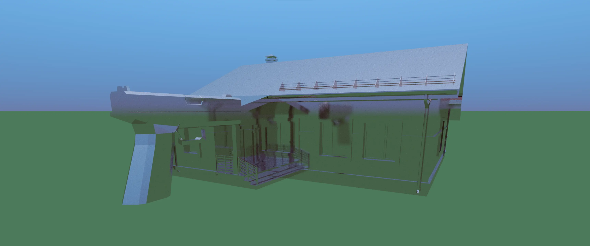

# Ray Tracing Engine

Ray tracing engine built in Rust using Vulkano.

## Features

- Ray tracing capabilities for realistic rendering
- Support for loading 3D models
- BVH implementation for efficient rendering
- Basic material handling
- Free camera
- Multi-platform

## Usage

For the time being, it is not possible to configure the engine other than by modifying the source code.

Several variables are of interest:
- `max_depth` in `shaders/compute.comp`: BVH max depth
- `nb_samples` in `shaders/compute.comp`: Samples per pixels
- `max_bounce_count` in `shaders/compute.comp`: Maximum number of bounces for a single ray
- Model path in `lib.rs`
- Materials in `models.rs`

Keep in mind that for obvious reasons, I didn't include the `.obj` files required to load models.
You will have to find suitable models and modify `lib.rs` to load include their paths.

To run the engine, use `cargo r -r`.

## Performances

I managed to run a smooth 140 fps at minimum with 10 rays per pixel and 5 max bounce in the scene shown in the screenshots, with an AMD Radeon RX 7900 XTX.

Because of the BVH-based collision detection, performances can drop depending on how big is the model on your screen.

## Screenshots

*Basic scene featuring two models with a reflective material.*

## To-Do

- Textures
- Optimization / Refactoring

## Does it run Doom ?

No. Not yet.

## Contributing

This is a personal project with an educational purpose.
As such, contributions are not welcome.
However, I'd be delighted to read about any issues you may encounter, and possible suggestions if you wish.

## License

This project is licensed under the [GNU GPLv3](https://opensource.org/license/gpl-3-0).
